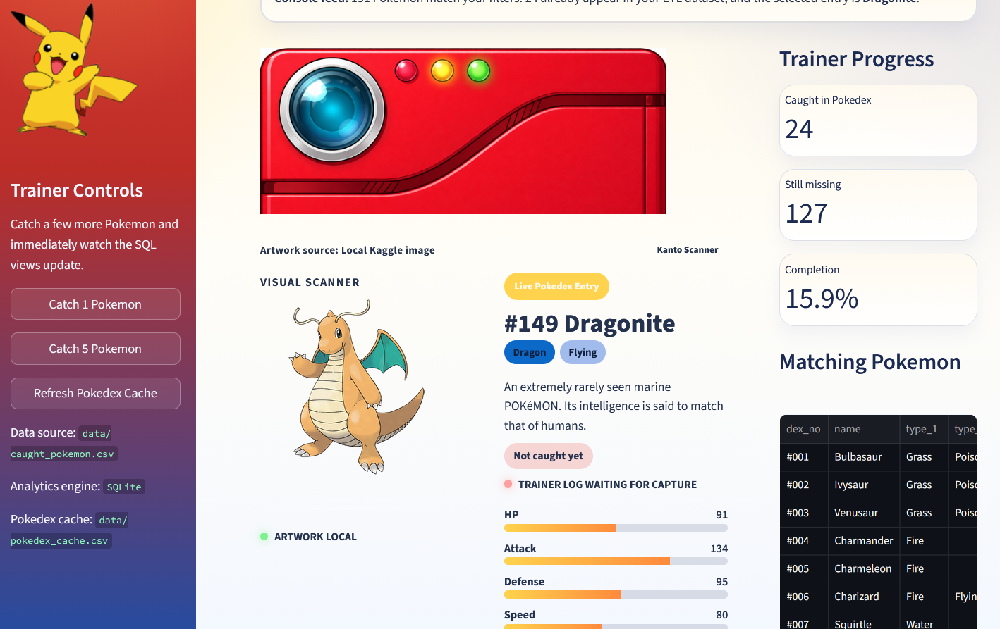

# Pokemon ETL Dashboard

A playful portfolio project that shows Python and SQL comprehension through a Pokemon-themed ETL pipeline and dashboard.

## Dashboard preview



## What it does

- Extracts random Pokemon from the PokéAPI with Python
- Transforms the response into a tidy tabular structure
- Loads the results into `data/caught_pokemon.csv`
- Analyzes the collected data with SQLite queries
- Visualizes the results in a cute Streamlit dashboard

## Project files

- `pokemon_ETL_game.py`: reusable ETL script for catching Pokemon and saving them to CSV
- `app.py`: Streamlit dashboard with charts, metrics, and SQL query views
- `SQL/pokemon_data_analysis.sql`: standalone SQL examples for SQLite
- `data/caught_pokemon.csv`: collected Pokemon data

## Run locally

Install dependencies:

```bash
pip install -r requirements.txt
```

Optional: download a larger Pokémon image set from Kaggle for the Pokédex cards:

```bash
python download_pokedex_assets.py
```

Catch Pokemon from the terminal:

```bash
python pokemon_ETL_game.py
```

Launch the dashboard:

```bash
streamlit run app.py
```

## Pokédex data

- The dashboard uses PokéAPI to load metadata for the original 151 Pokémon
- If you download the Kaggle image dataset, place or copy the files into `data/pokedex_images`
- When local images are available, the dashboard will try to use them before falling back to online artwork URLs

## Why this works well in a portfolio

This project connects API work, Python scripting, file handling, SQL querying, and dashboard design in one small but complete data story, while keeping the visuals fun and memorable with Pokemon references.
